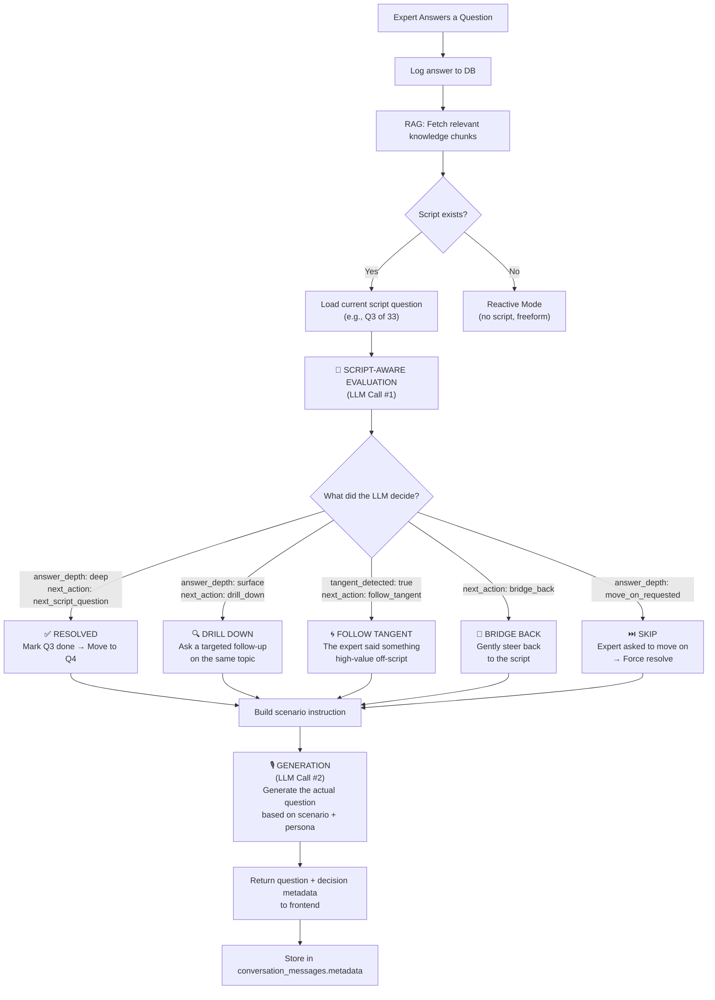

# 🧠 Interview Decision Engine — Full Transparency Layer

## What the User Wants
A clickable "Decision Log" button under every AI question that reveals **why** the AI chose that specific question — showing the full internal reasoning, script position, and evaluation verdict.

---

## How the Decision Framework Actually Works (Behind the Scenes)



## The Decision Data Object

Every AI response now carries this metadata:

```json
{
  "decision": {
    "action": "next_script_question",        // What the engine decided
    "answer_depth": "deep",                  // How deep was the expert's answer
    "scripted_question_resolved": true,      // Did this answer satisfy the script Q?
    "current_script_question": "Walk me through your first enterprise deal...",
    "script_progress": "3/33",               // Where we are in the script
    "tangent_detected": {
      "exists": false,
      "topic": null,
      "worth_following": false
    },
    "internal_monologue": "Expert gave a rich war story about the CTO pushback. Q3 is fully resolved. Moving to Q4 which targets the discovery phase.",
    "scenario_used": "PROCEED TO SCRIPT: How do you prepare for a discovery session?",
    "rag_sources": ["Video 3 - SA Role", "Handbook Ch.4"]
  }
}
```

## Implementation Plan

### 1. Backend Changes (`app.py`)
- Return the full `eval_data` + `scenario` + `chunks_used` in the API response under a `decision` key
- Already stored in `conversation_messages.metadata` — just need to make it more structured

### 2. Frontend Changes (`App.tsx`)
- Add a small "🧠 Decision Log" button below each AI message bubble
- On click, expand a card showing:
  - **Action Taken**: next_script_question / drill_down / follow_tangent / bridge_back
  - **Answer Depth**: deep / surface / evasive / move_on
  - **Script Position**: Q3/33
  - **Internal Monologue**: The AI's 1-sentence reasoning
  - **RAG Sources**: Which knowledge chunks grounded this decision
- Style it as a subtle, collapsible panel (dark card, monospace text)

### 3. CSS Changes (`index.css`)
- Add `.decision-toggle` button styles
- Add `.decision-panel` collapsible card styles

---

> [!NOTE]
> The decision data is already being computed on every exchange — we just weren't exposing it to the frontend. This change makes the "Glass Box" fully transparent.
