# 🎯 Pin-to-Pin Execution Plan — Pre-Interview Script Engine

---

## Part 1: WHERE YOU ARE NOW (Current State Inventory)

### ✅ What's DONE and Working

| Layer | Component | Status | Location |
|-------|-----------|--------|----------|
| **Database** | `knowledge_sources` (9 rows) | ✅ | Supabase |
| **Database** | `knowledge_chunks` (1,643 rows) | ✅ | Supabase |
| **Database** | `conversation_sessions` | ✅ | Supabase |
| **Database** | `conversation_messages` (with metadata) | ✅ | Supabase |
| **Backend** | FastAPI server (port 8001) | ✅ | [app.py](file:///c:/Users/harin/Downloads/journalist/backend/app.py) |
| **Backend** | Hybrid RAG (Vector + FTS) | ✅ | [app.py L99-180](file:///c:/Users/harin/Downloads/journalist/backend/app.py#L99-L180) |
| **Backend** | Evaluation Phase (internal monologue) | ✅ | [app.py L464-478](file:///c:/Users/harin/Downloads/journalist/backend/app.py#L464-L478) |
| **Backend** | Generation Phase (question crafting) | ✅ | [app.py L493-508](file:///c:/Users/harin/Downloads/journalist/backend/app.py#L493-L508) |
| **Backend** | Deepgram STT (`/transcribe`) | ✅ | [app.py L233-286](file:///c:/Users/harin/Downloads/journalist/backend/app.py#L233-L286) |
| **Backend** | Audit Log Persistence | ✅ | [app.py L289-378](file:///c:/Users/harin/Downloads/journalist/backend/app.py#L289-L378) |
| **Backend** | Persona Prompts (SA domain) | ✅ | [prompts.py](file:///c:/Users/harin/Downloads/journalist/backend/prompts.py) |
| **Frontend** | Landing page + Interview view | ✅ | [App.tsx](file:///c:/Users/harin/Downloads/journalist/frontend/src/App.tsx) |
| **Frontend** | Voice recording → Deepgram | ✅ | [App.tsx L103-173](file:///c:/Users/harin/Downloads/journalist/frontend/src/App.tsx#L103-L173) |

### ❌ What's MISSING (The Gap)

| # | What | Why It Matters |
|---|------|----------------|
| 1 | **`interview_scripts` table** | No place to store the prepared script |
| 2 | **Research Scan function** | AI doesn't read chunks before interviewing |
| 3 | **Theme Extraction prompt** | AI can't identify major topics from chunks |
| 4 | **Script Crafting prompt** | AI can't create a structured question script with chunk attribution |
| 5 | **`/prepare-interview` endpoint** | No way to trigger script preparation |
| 6 | **Script-aware interview logic** | Current flow ignores the script — just reacts |
| 7 | **Frontend script viewer** | User can't see what the AI prepared |

---

## Part 2: WHERE YOU NEED TO BE (The Vision)

### The Complete Flow — Start to Finish

```mermaid
sequenceDiagram
    participant U as Expert (You)
    participant FE as Frontend
    participant BE as Backend
    participant DB as Supabase (1,643 chunks)
    participant AI as GPT-4o-mini

    Note over U,AI: ━━━ PHASE A: SCRIPT PREPARATION ━━━
    U->>FE: Clicks "Initialize Interview"
    FE->>FE: Shows "🔍 Researching..." screen
    FE->>BE: POST /prepare-interview

    rect rgb(20, 80, 60)
        Note over BE,DB: Step A1: RESEARCH SCAN
        BE->>DB: Fetch 3 representative chunks × 9 sources = 27 chunks
        DB-->>BE: 27 chunks with source titles + markers
    end

    rect rgb(80, 60, 20)
        Note over BE,AI: Step A2: THEME EXTRACTION
        BE->>AI: "Read this research. Find 5-7 themes."
        AI-->>BE: 5-7 themes with emotional anchors + source evidence
    end

    rect rgb(80, 20, 40)
        Note over BE,AI: Step A3: SCRIPT CRAFTING
        BE->>AI: "Craft 12-15 questions across 4 phases.\nFor each question, cite WHICH chunk inspired it."
        AI-->>BE: Full interview script (JSON)
    end

    BE->>DB: Save script to interview_scripts table
    BE-->>FE: Script data (themes, questions, chunk citations)
    FE->>FE: Shows Script Preview with chunk attribution
    U->>FE: Reviews script → clicks "🎙️ Start Interview"

    Note over U,AI: ━━━ PHASE B: SCRIPT-DRIVEN INTERVIEW ━━━
    FE->>BE: POST /generate-question (empty = first hook)
    BE->>DB: Load script → Phase 1, Question 1
    BE-->>FE: First scripted question

    loop For Each Expert Answer
        U->>FE: Answers (voice/text)
        FE->>BE: POST /generate-question (with answer)

        rect rgb(40, 40, 80)
            Note over BE: DECISION ENGINE
            BE->>BE: 1. Evaluate answer against current script question
            BE->>BE: 2. Check: did expert answer the scripted topic?
            BE->>BE: 3. Check: did expert open a new interesting thread?
            BE->>BE: 4. DECIDE: Follow script OR follow the tangent?
            BE->>BE: 5. If tangent → follow for 1-2 Qs, then BRIDGE back
            BE->>BE: 6. Track: which script questions are COMPLETED vs PENDING
        end

        BE-->>FE: Next question + script progress metadata
    end

    Note over BE: All script questions completed → Synthesis phase
    BE-->>FE: Final synthesis question + "Interview Complete" signal
```



### The Key Behavior Rules

| Rule | Description |
|------|-------------|
| **Script is the North Star** | The AI MUST complete all scripted questions before ending |
| **Tangent Budget = 2** | If expert goes off-script, AI follows for max 2 questions, then bridges back |
| **Bridge, Don't Jerk** | When returning to script, bridge naturally: "That's fascinating about X. It actually connects to something I wanted to explore..." |
| **Progress Tracking** | Frontend shows: "Script Progress: 4/14 questions completed" |
| **Chunk Attribution** | Every scripted question shows exactly which chunk(s) inspired it and WHY |

---

## Part 3: THE EXECUTION PLAN (7 Tasks)

### Overview

```mermaid
gantt
    title Build Order (Sequential)
    dateFormat X
    axisFormat %s

    section Database
    Task 1 - Create interview_scripts table    :t1, 0, 1
    
    section Prompts
    Task 2 - Theme Extraction Prompt           :t2, 1, 2
    Task 3 - Script Crafting Prompt            :t3, 2, 3
    
    section Backend
    Task 4 - Research Scan Function            :t4, 3, 4
    Task 5 - /prepare-interview Endpoint       :t5, 4, 5
    Task 6 - Script-Aware Interview Logic      :t6, 5, 6
    
    section Frontend
    Task 7 - Script Viewer UI                  :t7, 6, 7
```



---

### TASK 1: Create `interview_scripts` Table
**Who:** You (run SQL in Supabase)
**File:** Supabase SQL Editor

```sql
CREATE TABLE IF NOT EXISTS interview_scripts (
    id                  UUID PRIMARY KEY DEFAULT gen_random_uuid(),
    session_id          TEXT NOT NULL,
    themes              JSONB NOT NULL DEFAULT '[]',
    full_script         JSONB NOT NULL DEFAULT '{}',
    research_briefing   JSONB NOT NULL DEFAULT '[]',
    total_questions     INT NOT NULL DEFAULT 0,
    questions_completed INT NOT NULL DEFAULT 0,
    estimated_duration  INT,
    status              TEXT NOT NULL DEFAULT 'draft'
                        CHECK (status IN ('draft', 'active', 'completed')),
    created_at          TIMESTAMPTZ NOT NULL DEFAULT now()
);

CREATE INDEX idx_scripts_session ON interview_scripts(session_id);

ALTER TABLE interview_scripts ENABLE ROW LEVEL SECURITY;
CREATE POLICY "Allow all access to interview_scripts"
    ON interview_scripts FOR ALL USING (true) WITH CHECK (true);
```

**What gets stored:**

| Column | Contents |
|--------|----------|
| `themes` | The 5-7 extracted themes with emotional anchors |
| `full_script` | Complete 4-phase question script with chunk citations |
| `research_briefing` | The 27 chunks that were scanned (for auditability) |
| `questions_completed` | Tracks how many scripted Qs have been asked (progress) |

---

### TASK 2: Theme Extraction Prompt
**Who:** Me
**File:** `backend/prompts.py` (append new prompt)

This prompt takes the 27 research chunks and extracts themes.

**Key Design Decisions:**
- Must output structured JSON for each theme
- Each theme must cite which sources it came from (chunk IDs + titles)
- Must identify the EMOTIONAL ANCHOR (what pressure/conflict exists)
- Must suggest a "never_asked" angle (what would make this interview unique)

**Output Schema:**
```json
[{
  "theme_id": 1,
  "theme_title": "The Whiteboard Hostage Situation",
  "editorial_rationale": "Why a journalist would care about this",
  "emotional_anchor": "humiliation → recovery → wisdom",
  "source_evidence": [
    {
      "source_title": "Video 7 - What Does a SA Do?",
      "chunk_preview": "first 150 chars of the chunk...",
      "location_marker": "Segment 12"
    }
  ],
  "never_asked_angle": "What did it FEEL like when you lost the room?"
}]
```

---

### TASK 3: Script Crafting Prompt
**Who:** Me
**File:** `backend/prompts.py` (append new prompt)

This prompt takes the themes + research and creates the full question script.

**Key Design Decisions:**
- Every question MUST cite which chunk(s) inspired it
- Every question MUST explain WHY (the editorial reasoning)
- Questions organized into 4 phases
- Each question has a contingency (backup if expert gives a short answer)

**Output Schema:**
```json
{
  "interview_arc": {
    "phase_1_warmup": {
      "phase_goal": "Build rapport, open emotional channels",
      "questions": [{
        "question_id": "Q1",
        "question_text": "Take me back to your very first enterprise deal...",
        "phase": "warmup",
        "theme_id": 1,
        "emotional_trigger": "nostalgia, early-career vulnerability",
        "chunk_attribution": {
          "chunk_content": "The first 150 chars of the chunk that inspired this...",
          "source_title": "Mastering Technical Sales Ch.3",
          "source_type": "book",
          "location_marker": "Chunk 89",
          "why_this_chunk": "This chunk discusses the 'reality shock' new SAs face. Perfect entry point to trigger an authentic early-career war story."
        },
        "contingency": "If short answer → 'What specifically surprised you about how different reality was from training?'",
        "estimated_minutes": 3,
        "status": "pending"
      }]
    },
    "phase_2_deep_dives": { ... },
    "phase_3_challenge": { ... },
    "phase_4_synthesis": { ... }
  }
}
```

> [!IMPORTANT]
> The `chunk_attribution.why_this_chunk` field is the KEY differentiator. This is the journalist's editorial reasoning — "I read this chunk, and it made me think of THIS question because..."

---

### TASK 4: Research Scan Function
**Who:** Me
**File:** `backend/app.py` (new function)

```
New function: research_scan() → dict
```

**What it does:**
1. Fetches all 9 knowledge sources
2. For each source, fetches chunks at positions [start, middle, end] → 27 chunks
3. Formats them into a Research Briefing with metadata
4. Returns structured data for the prompts

**Pseudocode:**
```python
async def research_scan() -> dict:
    sources = supabase.table("knowledge_sources").select("id, title, source_type").execute()
    
    briefing = []
    for source in sources.data:
        # Get all chunks for this source, ordered
        chunks = supabase.table("knowledge_chunks")
            .select("content, location_marker")
            .eq("source_id", source["id"])
            .order("created_at")
            .execute()
        
        total = len(chunks.data)
        # Pick 3: start, middle, end
        indices = [0, total // 2, total - 1]
        
        for idx in indices:
            briefing.append({
                "source_title": source["title"],
                "source_type": source["source_type"],
                "source_id": source["id"],
                "location_marker": chunks.data[idx]["location_marker"],
                "content": chunks.data[idx]["content"],
                "position": "start" if idx == 0 else "middle" if idx == total//2 else "end"
            })
    
    return {"briefing": briefing, "sources_scanned": len(sources.data), "chunks_sampled": len(briefing)}
```

---

### TASK 5: `/prepare-interview` Endpoint
**Who:** Me
**File:** `backend/app.py` (new endpoint)

```
POST /prepare-interview
Body: { session_id, topic }
Returns: { script, themes, research_stats }
```

**Pipeline inside this endpoint:**
```
1. research_scan()              → 27 chunks
2. LLM(THEME_EXTRACTION)       → 5-7 themes
3. LLM(SCRIPT_CRAFTING)         → 12-15 questions in 4 phases
4. Save to interview_scripts    → Supabase
5. Save backlog to interview_sessions → Supabase
6. Return everything to frontend
```

**Also adds:**
```
GET /interview-script/{session_id}     → Returns the full saved script
```

---

### TASK 6: Script-Aware Interview Logic
**Who:** Me
**File:** `backend/app.py` (modify `/generate-question`)

This is the **most critical change**. The current interview flow is purely reactive. We need to make it **script-aware**.

**Current Flow (Reactive Only):**
```
Expert answers → RAG search → Evaluate → Generate → Return question
```

**New Flow (Script-Driven + Adaptive):**
```
Expert answers → Load script state → Evaluate answer against CURRENT SCRIPT QUESTION
    ├── IF answer covers scripted topic → Mark as COMPLETED → Move to NEXT script question
    ├── IF answer opens interesting tangent → Follow tangent (max 2 turns) → BRIDGE back
    ├── IF answer is off-topic → Gently redirect to script
    └── IF all script questions completed → Move to SYNTHESIS phase
```

**New Evaluation Prompt (replaces EVALUATION_PHASE_PROMPT):**
```
You are evaluating the expert's answer against the INTERVIEW SCRIPT.

CURRENT SCRIPT QUESTION: {current_script_question}
EXPERT'S ANSWER: {expert_answer}
SCRIPT PROGRESS: {completed}/{total} questions completed
TANGENT BUDGET: {tangent_turns_remaining}/2 turns

Analyze:
1. Did the expert adequately address the scripted question?
2. Did the expert mention something compelling that deserves a 1-2 turn tangent?
3. Should we follow the tangent or move to the next script question?

Return JSON:
{
  "scripted_question_resolved": true/false,
  "tangent_detected": {
    "exists": true/false,
    "topic": "what they went off about",
    "worth_following": true/false,
    "reason": "why or why not"
  },
  "next_action": "next_script_question" | "follow_tangent" | "bridge_back_to_script",
  "bridge_suggestion": "If bridging back, how to transition naturally"
}
```

**State Tracking Fields (per session):**
```
current_script_index: 3          # Which script Q we're on
tangent_turns_used: 1            # How many tangent turns we've taken
tangent_turns_max: 2             # Max allowed before bridging back
script_questions_completed: []   # List of completed Q IDs
```

---

### TASK 7: Frontend Script Viewer
**Who:** Me
**File:** `frontend/src/App.tsx` (new view)

**New view: `'script-preview'`** — shown after script preparation, before interview starts.

**What it shows:**
```
┌─────────────────────────────────────────────────────────────┐
│  📋 INTERVIEW SCRIPT PREPARED                               │
│  ─────────────────────────────────────────────────────────── │
│  Sources scanned: 9 │ Chunks analyzed: 27 │ Duration: ~45m  │
│                                                              │
│  ── THEMES EXTRACTED ──────────────────────────────────────  │
│                                                              │
│  1. 🔥 The Whiteboard Hostage Situation                     │
│     "Every SA has a story where a CTO hijacked the session" │
│     Emotional Anchor: Humiliation → Recovery → Wisdom       │
│     Sources: Video 7, Book Ch.8                              │
│                                                              │
│  2. 🔥 Shadow Pilots Nobody Authorized                      │
│     ...                                                      │
│                                                              │
│  ── QUESTION SCRIPT ───────────────────────────────────────  │
│                                                              │
│  PHASE 1: WARM-UP (2 questions)                              │
│  ┌──────────────────────────────────────────────────────┐    │
│  │ Q1: "Take me back to your very first deal..."        │    │
│  │                                                      │    │
│  │ 📎 Based on:                                         │    │
│  │ ┌────────────────────────────────────────────────┐   │    │
│  │ │ 📖 Mastering Technical Sales, Ch.3              │   │    │
│  │ │ "The reality shock that new SAs face when..."   │   │    │
│  │ │                                                 │   │    │
│  │ │ WHY: This chunk discusses the gap between       │   │    │
│  │ │ training and reality. Perfect entry point to    │   │    │
│  │ │ trigger an authentic early-career war story.    │   │    │
│  │ └────────────────────────────────────────────────┘   │    │
│  │                                                      │    │
│  │ 🔄 Contingency: "What surprised you most about      │    │
│  │    how different reality was from training?"          │    │
│  └──────────────────────────────────────────────────────┘    │
│                                                              │
│  PHASE 2: DEEP DIVES (6 questions)                           │
│  ...                                                         │
│                                                              │
│  ── INTERVIEW PROGRESS (during interview) ─────────────────  │
│  ███████░░░░░░░░░░░░  4/14 questions · Phase 2              │
│                                                              │
│  [🎙️ Start Interview]                                       │
└─────────────────────────────────────────────────────────────┘
```

**During the interview**, a collapsible side panel shows:
- Current script progress (4/14)
- Which phase we're in
- Which script question is active
- If we're on a tangent (and how many turns left)

---

## Part 4: DISTANCE FROM GOAL

### Progress Bar

```
DONE ████████████████░░░░░░░░░░░░░░ TODO
     ^^^^^^^^^^^^^^^^^^^            ^^^^^^^^^^^^^^^^^^^
     What you have now              What you need

Estimated: ~60% of the foundation is built.
Remaining: ~40% is the Script Engine + Frontend.
```

### Detailed Distance

| Category | Done | Remaining | Difficulty |
|----------|------|-----------|------------|
| **Database** | 4/5 tables | 1 table (`interview_scripts`) | 🟢 Easy (just SQL) |
| **RAG Pipeline** | Fully working | Needs `research_scan()` wrapper | 🟢 Easy |
| **Prompts** | 5/7 prompts exist | Need 2 new: Theme + Script | 🟡 Medium (prompt engineering) |
| **Backend Logic** | Reactive interview works | Need script-aware logic + new endpoint | 🟠 Hard (decision engine) |
| **Frontend** | Interview + Ingest views | Need Script Preview + Progress UI | 🟡 Medium (new components) |
| **Audit Trail** | Persists to Supabase | Need script metadata in audit | 🟢 Easy (already structured) |

### Build Time Estimate

| Task | Estimated Work |
|------|---------------|
| Task 1 (DB table) | 1 min (you run SQL) |
| Task 2 (Theme prompt) | 5 min |
| Task 3 (Script prompt) | 8 min |
| Task 4 (Research scan) | 5 min |
| Task 5 (Prepare endpoint) | 10 min |
| Task 6 (Script-aware logic) | 15 min |
| Task 7 (Frontend viewer) | 15 min |
| **Total** | **~60 min of build time** |

---

## Part 5: EXECUTION ORDER (Step by Step)

```
Step 1 → YOU: Create interview_scripts table (SQL above)
Step 2 → ME:  Add THEME_EXTRACTION_PROMPT to prompts.py
Step 3 → ME:  Add SCRIPT_CRAFTING_PROMPT to prompts.py
Step 4 → ME:  Add research_scan() function to app.py
Step 5 → ME:  Add POST /prepare-interview endpoint to app.py
Step 6 → ME:  Modify /generate-question to be script-aware
Step 7 → ME:  Build Script Preview view in App.tsx
Step 8 → BOTH: End-to-end test
```

> [!CAUTION]
> **Step 1 must be done by YOU first** — I cannot create Supabase tables. Once you run the SQL and confirm, I will execute Steps 2-7 in sequence.

---

## Part 6: THE PERSONA'S ROLE IN ALL THIS

The persona in [prompts.py L146-171](file:///c:/Users/harin/Downloads/journalist/backend/prompts.py#L146-L171) (`JOURNALIST_BASE_PERSONA`) serves as the **editorial identity** that runs through EVERYTHING:

| Where | How the Persona is Used |
|-------|-------------------------|
| **Theme Extraction** | Persona decides which themes are "editorially compelling" |
| **Script Crafting** | Persona shapes the question style (empathetic, battle-aware, zero-trust) |
| **First Hook** | Persona frames the opening question |
| **Live Interview** | Persona bridges between answers ("That moment when the CTO pushed back...") |
| **Tangent Decisions** | Persona decides if a tangent is worth following or if we need to redirect |
| **Synthesis** | Persona frames the final "legacy" question |

The persona is the **constant thread** across all 7 tasks. It's not just a prompt — it's the editorial voice of the entire interview.
